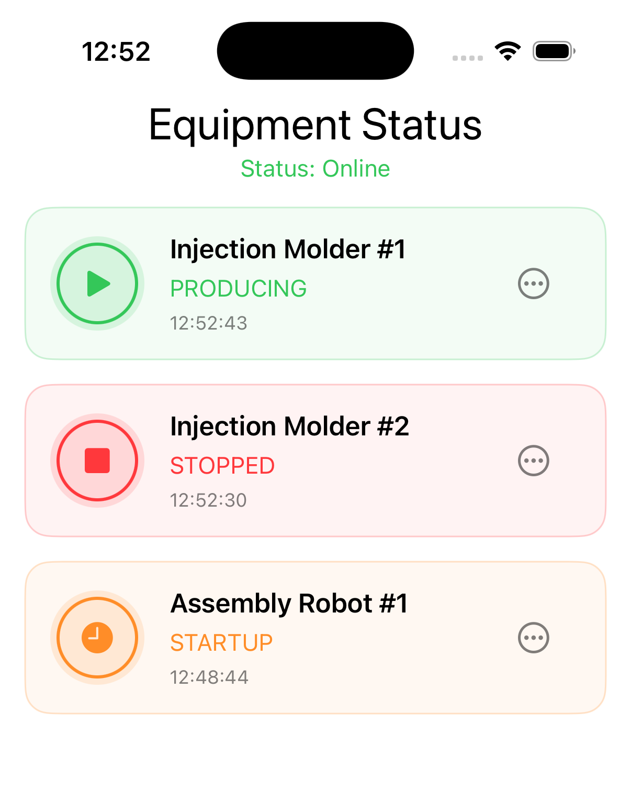
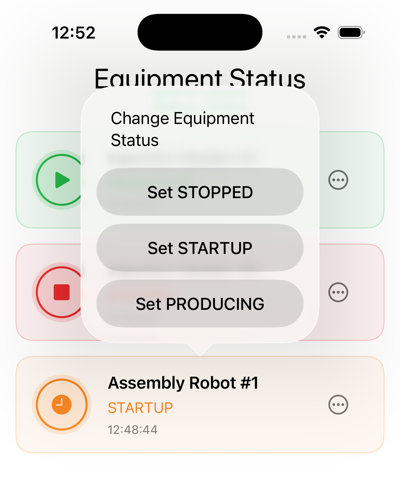
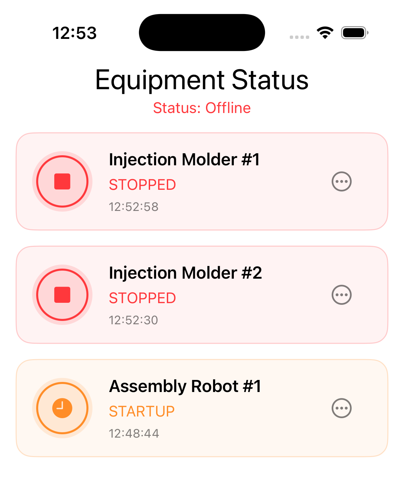

# EquipmentManager
**iOS app for monitoring industrial equipment status in real time over WebSocket, with manual status overrides**

***How to run the app***

Open the project in Xcode, select a simulator running iOS 17 or later, and hit Run.

For live status updates, the app expects a WebSocket server reachable at `ws://localhost:8080`. Below, you will find full instructions on how to configure and run it. Without it, the app will load the equipment list from a mock repository and displays a 'WebSocket is not connected' error. However, equipment status changes made from the UI are applied locally.

***Features:***

* Browse a list of equipment with name, current status, and last-updated time
* Color-coded status indicator per device (stopped / startup / producing)
* Change equipment status manually from a confirmation dialog
* Receive live status updates pushed from a WebSocket server
* Automatic reconnect with periodic ping/pong heartbeat
* Connection status banner reflecting the live socket state

***Recipe to run local WebSocket server:***

* Install `node` (if you already don't have it):

``brew install node``

* Install `ws` package (WebSocket server/client)

``npm install ws``  

* In terminal, go to `WebSocketServer` folder and run the WebSocket server:

``node server.js``

* WebSocket server runs at `ws://localhost:8080`. It waits for you to run the app and consume some updates :)

***Tech stack:***

* Swift
* SwiftUI
* Combine
* Async/await + AsyncStream
* URLSessionWebSocketTask
* OSLog

***Architectural Pattern:***

* MVVM with `ObservableObject` and Combine
* `PassthroughSubject` as the view-to-viewmodel intent channel

***Stimulants:***

* Earl Grey tea
* Cream cake

| Equipment list | Change status | Disconnected state |
|:---------:|:---------:|:---------:|
|  |  |  |

Here is the demo.

https://github.com/user-attachments/assets/890db4df-6c8c-410b-b417-ad5774777803
